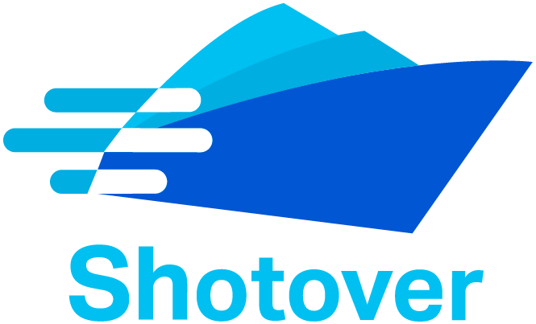

  

## Documentation

For full documentation please go to [https://docs.shotover.io/](https://docs.shotover.io/shotover-blog/docs/user-guide/introduction.html)

## Building

Shotover is supported on Linux and macOS.
To build Shotover from source please refer to [the contributing documentation](https://docs.shotover.io/shotover-blog/docs/contributing.html)

## What is Shotover?

Shotover is a high performance, configurable and extensible L7 data-layer proxy for controlling, managing and modifying the flow of database requests in transit. It can be used to solve many different operational and interoperability challenges by transparently intercepting and transforming queries. It is transparent in the sense that it can be plugged into your architecture without requiring application change.

Shotover currently supports the following technologies:

* Cassandra (CQL4 + CQL5)
* Valkey/Redis (RESP2)
* Kafka (Kafka Wire Protocol)

## What problems does Shotover solve?

Concrete examples where Shotover has been applied include:

* [Multi-region, active-active valkey](https://github.com/shotover/shotover-examples/tree/main/valkey-backup-cluster)
* [Cassandra AWS PrivateLink](https://github.com/shotover/shotover-examples/blob/main/cassandra-1-many/topology.yaml)
* [Kafka GCP Private Service Connect](https://github.com/shotover/shotover-examples/blob/main/kafka-1-many/topology.yaml)

More broadly, Shotover is designed to be used for a very wide ranging class of problems where it is useful to transparently intercept a database call and redirect/rewrite it. This allows you to change the behaviour of running applications at the infrastructure level without change to the application code itself.
Some examples where we envisage Shotover could be deployed include:

* Enabling use of AWS PrivateLink or GCP Private Service Connect for databases that do not support distinct load balancer nodes.
* Moving very large or very hot tenants/customers/keys (that can cause unbalanced partition problems in some systems) to a separate data store by intercepting and redirecting queries for those particular keys
* Dual writing and/or query translation to allow the underlying storage technology to be changed (for example, from DynamoDB to Apache Cassandra)
* As an alternative to Change Data Capture technology to send writes to a message stream such as Apache Kafka in addition to the primary database
* Adding auditing, encryption or other security measures

Shotover does not provide transforms for all of these yet, but with a custom transform these can be achieved today.

## Custom Transforms

Shotover comes with some predefined Transforms for common operations.
However Shotover also allows for user defined [Custom Transforms](https://github.com/shotover/shotover-custom-transforms-template) to be written in rust.
Custom Transforms are given access to the AST of all messages passing through, allowing for any kind of transformation to be performed.

## Deploying Shotover

Shotover can be deployed in several different ways based on the problem you are trying to solve:

* As an application sidecar - Shotover is pretty lightweight, so feel free to deploy it as a sidecar to each of your application
instances.
* As a stand-alone proxy - If you are building a Service/DBaaS/Common data layer, you can deploy Shotover on standalone hardware
and really let it fly.
* As a sidecar to your database - You can also stick Shotover on the same instance/server as your database is running on; we do it, so
we won't judge you.

## Name

Shotover refers to the Shotover (Kimi-ākau) river in Otago, New Zealand - close to Queenstown and eventually flowing into Lake Wakatipu
via the Kawarau River, it's famous for white water rafting, bungy-jumping, fast rapids and jet boating.
