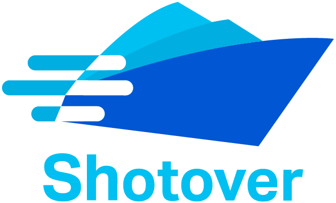

Shotover-proxy is an open source, high performance L7 data-layer proxy for controlling, managing and modifying the flow  of database requests in transit. It can be used to solve many different operational and interoperability challenges for teams where polyglot persistence (many different databases) is common.

The following pages are a good place to learn more:

* [Introduction](user-guide/introduction.md) for more information on what Shotover Proxy is, why it exists and some of the underlying philosophies behind it.
* [Getting started guide](user-guide/getting-started.md) for details on how to jump straight in and get up and running.
* [Concepts](user-guide/concepts.md) for a deeper dive into some of the fundamental shotover concepts.

## Deploying Shotover

Shotover can be deployed in a number of ways, it will generally be based on the problem you are trying to solve, but they all fall into three categories:

* As an application sidecar - Shotover is pretty lightweight, so feel free to deploy it as a sidecar to each of your application instances.
* As a stand alone proxy - If you are building a Service/DBaaS/Common data layer, you can deploy Shotover on standalone hardware and really let it fly.
* As a sidecar to your database - You can also stick Shotover on the same instance/server as your database is running on, we do it, so we won't judge you.

See the [deployment guide](user-guide/deployment.md) for details.

## TODO/Roadmap

* Support relevant xDS APIs (so Shotover can play nicely with service mesh implementations)
* Support hot-reloads and a dynamic configuration API.
* Additional sources (DynamoDB and PostgreSQL are good first candidates).
* Add support for rate limiting, explicit back-pressure mechanisms etc
* Additional Distributed algorithm transform primitives (e.g RAFT, 2PC, etc)
* Additional sink transforms (these generally get implemented alongside sources).
* Support user-defined / generated sources (e.g. thrift or a gRPC service from a proto definition).
* Simulation testing once tokio-rs/simulation reaches compatibility with tokio-2.0
* zero-copy pass-through transforms and in-place query editing (perf)

## Name

Shotover refers to the Shotover (Kimi-ākau) river in Otago, New Zealand - close to Queenstown and eventually flowing into Lake Wakatipu via the Kawarau River, it's famous for white water rafting, bungy-jumping, fast rapids and jet boating.
