# End to end overview

This document will use Valkey as an example for explaining the end to end flow of messages through shotover.
We will walk through a single request from the client and Valkey's response.
The same flow within Shotover is used for all protocols, so this document should still be useful if you are working with another protocol.

The general flow of messages though Shotover looks like:


## Shotover Config

In the scenario this document works through, Shotover will be run with the following `topology.yaml` configuration:

```yaml
sources:
  - Valkey:
      name: "valkey"
      listen_addr: "127.0.0.1:6379"
      chain:
        # A made up transform for our example.
        - SomeTransform
        # Another made up transform for our example
        - AnotherTransform
        # The sink transform that routes Valkey requests to the correct node in the cluster
        - ValkeySinkCluster:
            first_contact_points:
              - "172.16.1.2:6379"
              - "172.16.1.3:6379"
              - "172.16.1.4:6379"
            connect_timeout_ms: 3000
```

## The client sends request

A user sends a Valkey command through their valkey client:

1. The user runs a [set](https://valkey.io/commands/set/) command by calling: `client.set("foo", "bar")`.
2. The client translates the `set(..)` arguments into a RESP request that looks like: `["SET", "foo", "bar"]`
3. A hash is taken of the key `foo` which is used to choose which Shotover node to send the request to.
4. The RESP request is converted into the [RESP wire format](https://redis.io/docs/latest/develop/reference/protocol-spec/), which is purely ascii except for user data:

```text
*3
$3
SET
$3
foo
$3
bar
```

`*3` means an array with 3 elements.
The first element is `$3\nSET`, which means a string of length 3 containing `SET`.
The second and third arguments are also strings of length 3: `$3\nfoo` and `$3\nbar`

5. The bytes of the message are sent over a TCP connection to the chosen Shotover node. In this example, no such connection exists so a new one is made.

## Shotover accepts a new connection

When [ValkeySource](https://github.com/shotover/shotover-proxy/blob/de0d1a3fafb92cf1875dd9ca79b277faf3cb3e77/shotover/src/sources/valkey.rs#L54) is created during shotover startup, it creates a `TcpCodecListener` and then calls [TcpCodecListener::run](https://github.com/shotover/shotover-proxy/blob/de0d1a3fafb92cf1875dd9ca79b277faf3cb3e77/shotover/src/server.rs#L160) which listens in a background task for incoming TCP connections on the sources configured port.
`TcpCodecListener` accepts a new connection from the Valkey client and constructs and runs a `Handler` type, which manages the connection.
The Handler type creates:

* read/write tasks around the TCP connection.
  * A `ValkeyEncoder` and `ValkeyDecoder` pair is created from [ValkeyCodecBuilder](https://github.com/shotover/shotover-proxy/blob/de0d1a3fafb92cf1875dd9ca79b277faf3cb3e77/shotover/src/server.rs#L449).
  * The `ValkeyEncoder` is given to the [write task](https://github.com/shotover/shotover-proxy/blob/de0d1a3fafb92cf1875dd9ca79b277faf3cb3e77/shotover/src/server.rs#L517)
  * The `ValkeyDecoder` is given to the [read task](https://github.com/shotover/shotover-proxy/blob/de0d1a3fafb92cf1875dd9ca79b277faf3cb3e77/shotover/src/server.rs#L467)
* a new [transform chain](https://github.com/shotover/shotover-proxy/blob/de0d1a3fafb92cf1875dd9ca79b277faf3cb3e77/shotover/src/server.rs#L208) instance to handle the requests coming in from this connection.
  * This transform chain instance handles a single connection passing from the client to Valkey and isolates it from other connections.

The handler type then [continues to run](https://github.com/shotover/shotover-proxy/blob/de0d1a3fafb92cf1875dd9ca79b277faf3cb3e77/shotover/src/server.rs#L677), routing requests and responses between the transform chain and the client connection read/write tasks.

Finally, at this point our callstack will look something like this.
Each section of this document will include such a diagram, showing a high level representation of the call stack during the section.

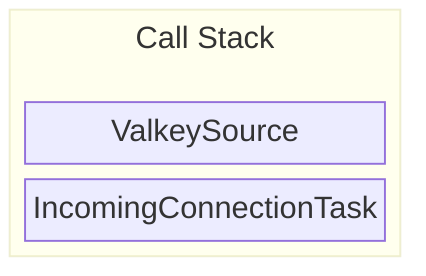

## Source ValkeyDecoder

The `tokio_util` crate provides an [Encoder](https://docs.rs/tokio-util/latest/tokio_util/codec/trait.Encoder.html) trait and a [Decoder](https://docs.rs/tokio-util/latest/tokio_util/codec/trait.Decoder.html) trait.

Through this interface:

* we provide the logic for how to encode and decode messages into and out of a buffer of bytes by implementing the traits.
* tokio provides the logic for reading and writing the bytes from the actual TCP connection via the [FramedWrite](https://docs.rs/tokio-util/latest/tokio_util/codec/struct.FramedWrite.html) and [FramedRead](https://docs.rs/tokio-util/latest/tokio_util/codec/struct.FramedRead.html) types.

Since TCP itself provides a stream of bytes without any application level framing [^1] it is up to the database protocol itself to implement framing on top of TCP.
So the logic of a `Decoder` implementation must gracefully handle incomplete messages. Leaving any half received messages in the buffer.

Protocols like kafka and cassandra achieve framing by including a message length in bytes in the header. This is great for Shotover since it means we can avoid parsing the entire message when its not needed.
However Valkey does not have a header so we always need to parse the entire message to find out where it ends.

The [ValkeyDecoder](https://github.com/shotover/shotover-proxy/blob/d7547741d8b10c5f64f133e1145bf843f7fb57ec/shotover/src/codec/valkey.rs#L74) is an example of a `Decoder` implementation.

Lets step through the `ValkeyDecoder` implementation:

[^1]: Framing is how a protocol defines where individual messages begin and end.

### Reading a message

The first thing [ValkeyDecoder::decode](https://github.com/shotover/shotover-proxy/blob/026327ff78046d29e9a7613baecca506c874d05b/shotover/src/codec/valkey.rs#L98) does is attempt to [parse a Valkey message from the beginning of the bytes](https://github.com/shotover/shotover-proxy/blob/026327ff78046d29e9a7613baecca506c874d05b/shotover/src/codec/valkey.rs#L100).
This is done by calling [decode_bytes_mut](https://docs.rs/redis-protocol/latest/redis_protocol/resp2/decode/fn.decode_bytes_mut.html) from the `redis-protocol` crate.
There are a few possible return values:

* [Failure to parse because the message is not fully received yet](https://github.com/shotover/shotover-proxy/blob/026327ff78046d29e9a7613baecca506c874d05b/shotover/src/codec/valkey.rs#L186) - in this case we return `None` so that the `FramedRead` will call us again when more bytes have been received.
* [Any other kind of parse error](https://github.com/shotover/shotover-proxy/blob/026327ff78046d29e9a7613baecca506c874d05b/shotover/src/codec/valkey.rs#L102) - we bubble up the error, eventually resulting in the connection being terminated.
* [a message is successfully returned](https://github.com/shotover/shotover-proxy/blob/026327ff78046d29e9a7613baecca506c874d05b/shotover/src/codec/valkey.rs#L103) - we continue on and pass the message to the next stage.
  * In this case the parsed message forms a structure of:

```rust
ValkeyFrame::Array(vec![
   ValkeyFrame::BulkString("SET"),
   ValkeyFrame::BulkString("foo"),
   ValkeyFrame::BulkString("bar"),
])
```

### Constructing a `Message`

All messages in Shotover are stored in a [Message](https://docs.rs/shotover/latest/shotover/message/struct.Message.html) type which is passed through each transform.
`Message` abstracts over all the different protocols supported by Shotover.

The `ValkeyDecoder` constructs a message by calling [Message::from_bytes_and_frame_at_instant](https://github.com/shotover/shotover-proxy/blob/026327ff78046d29e9a7613baecca506c874d05b/shotover/src/message/mod.rs#L131).
We pass in the raw bytes of the message and the parsed frame of the message, as well as a timestamp which is used purely for metrics.
Protocols with better framing mechanisms will use a different constructor to avoid parsing the whole request unless its really needed.

When the Message is created a new ID is [generated and stored in the Message](https://github.com/shotover/shotover-proxy/blob/026327ff78046d29e9a7613baecca506c874d05b/shotover/src/message/mod.rs#L140). This ID is a randomly generated 128bit integer used by transforms to match responses with their corresponding requests. This value is meaningful only within Shotover and is not part of the Valkey protocol.
Lets say in this example our message is assigned the ID `0xd12ac2704d19e53ef3fea94b4885c950`.

`ValkeyDecoder::decode` then `return`s the `Message` to the caller.
The caller in this case being the `tokio_util` helper `FramedRead`.

Since the ValkeyDecoder runs on the read task the call stack is independent from the main call stack.

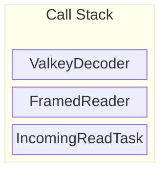

## Codec to transform glue

The `Message` then goes through a few steps before it actually reaches a transform.

1. The [read task created by the Handler](https://github.com/shotover/shotover-proxy/blob/de0d1a3fafb92cf1875dd9ca79b277faf3cb3e77/shotover/src/server.rs#L468)
   1. The message is read from the `FramedRead`
   2. The message is sent through a [tokio channel](https://docs.rs/tokio/latest/tokio/sync/mpsc/struct.UnboundedSender.html)
   * This logic is specifically run in a separate task to enable decoding of incoming requests to run in parallel of any messages currently being process by transforms (calling tokio async code will execute on the same core unless a task is used)
2. The [Handler::run_loop](https://github.com/shotover/shotover-proxy/blob/de0d1a3fafb92cf1875dd9ca79b277faf3cb3e77/shotover/src/server.rs#L677) method loops for the lifetime of the incoming connection and:
   1. Listens for requests from the read task over the channel
   2. If there are any requests, all pending requests are collected into a batch (`Vec<Message>`) In our case the client is sending requests serially, waiting for responses each time. So this batch will contain only a single request.
   3. Creates a [ChainState](https://github.com/shotover/shotover-proxy/blob/4eed01edf42e7a9adca7016854dcbb6f08a25f68/shotover/src/transforms/mod.rs#L149). `ChainState` contains all the chain level state accessed by transforms. This includes things like the batch of requests, the IP address and port the client connected to, a flag to allow transforms to force close the connection.
   Transforms are free to alter the `ChainState` and the next transform in the chain will receive the same altered `ChainState`.
   4. Calls [TransformChain::process_request](https://github.com/shotover/shotover-proxy/blob/de0d1a3fafb92cf1875dd9ca79b277faf3cb3e77/shotover/src/transforms/chain.rs#L162) passing it the `ChainState`.
3. `TransformChain::process_request`:
   1. Inserts the list of transforms in the chain into `ChainState`
   2. Calls `ChainState::call_next_transform`
4. [ChainState::call_next_transform](https://github.com/shotover/shotover-proxy/blob/026327ff78046d29e9a7613baecca506c874d05b/shotover/src/transforms/mod.rs#L200):
   1. Pops the first transform from the list of transforms.
   2. Calls the transforms `transform` method, beginning execution of the transform.

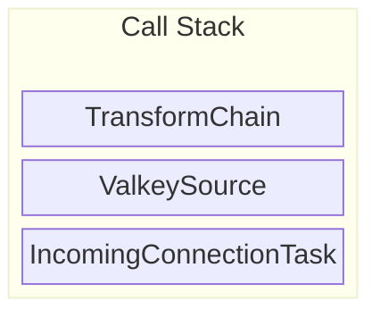

## Some Transform

The first transform in the chain begins executing.
Most transforms look something like this:

```rust
    async fn transform<'shorter, 'longer: 'shorter>(
        &mut self,
        chain_state: &'shorter mut ChainState<'longer>,
    ) -> Result<Messages> {
        // iterate over all requests
        for request in &mut chain_state.requests {
            // each request is of type Message
            if let Some(Frame::Valkey(frame)) = request.frame() {
                // Calling `frame` on the request returns the parsed frame of the message.
                // This assertion is silly, but would pass for the example request we are working through
                assert_eq!(
                    frame,
                    ValkeyFrame::Array(vec![
                        ValkeyFrame::BulkString(Bytes::from_static("SET")),
                        ValkeyFrame::BulkString(Bytes::from_static("foo")),
                        ValkeyFrame::BulkString(Bytes::from_static("bar")),
                    ])
                );

                // At this point the transform is able to read and or rewrite the request as it pleases.
                // But for this example we will assume that no rewriting occurs.
            }
        }

        let mut responses = chain_state.call_next_transform().await?;

        for response in responses.iter_mut() {
            // do something with the responses
        }

        Ok(())
    }
```

At the point where `call_next_transform` is called, the next transform in the chain is popped from the list in `ChainState` and executed.
Execution of this transform asynchronously waits until the request is completely sent.

In the case of `ValkeySinkCluster` (the sink transform used in this example) `call_next_transform` will also block until a response for each request has been received. But that is legacy behavior that the other transforms do not have. So we will pretend that is not the case for the rest of this document.

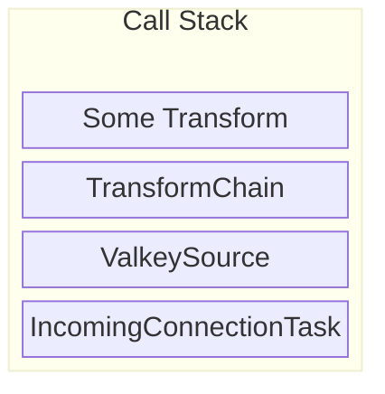

## Another Transform

Another transform is called.
This is the same as the previous section.
However this time it pops the final transform from the list of transforms and executes it, in this scenario the final transform is `ValkeySinkCluster`.

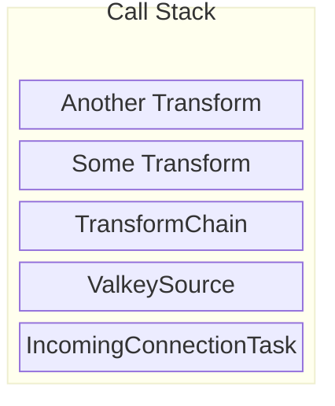

## ValkeySinkCluster sends request

The [ValkeySinkCluster](https://github.com/shotover/shotover-proxy/blob/de0d1a3fafb92cf1875dd9ca79b277faf3cb3e77/shotover/src/transforms/valkey/sink_cluster.rs#L1022) transform is quite complex so I will only describe it at a high level.

1. For each request in `ChainState`
   1. Determine how to route the request via [RoutingInfo::for_command_frame](https://github.com/shotover/shotover-proxy/blob/de0d1a3fafb92cf1875dd9ca79b277faf3cb3e77/shotover/src/transforms/valkey/sink_cluster.rs#L726), in this case, since we are routing a `set` with key of `foo` we get `RoutingInfo::Slot(hash_of(foo))`.
   2. [Lookup the computed slot value](https://github.com/shotover/shotover-proxy/blob/de0d1a3fafb92cf1875dd9ca79b277faf3cb3e77/shotover/src/transforms/valkey/sink_cluster.rs#L239) against the list of Valkey nodes to find which Valkey node should handle this slot.
   3. Send the request to the Valkey node. A new outgoing connection is created if it does not exist yet.

Other functionality of ValkeySinkCluster not listed above includes:

* fetching and managing the metadata required for routing requests.
* working in either cluster hiding or cluster handling mode, the topology.yaml configuration defined earlier used hiding mode, so thats how our request is handled.

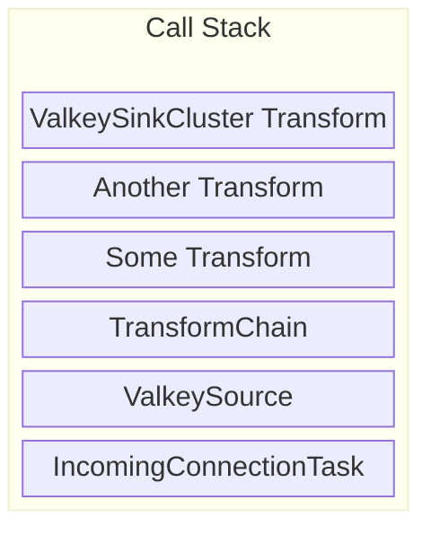

## SinkConnection send

The standard way to form an outgoing connection is with [SinkConnection](https://github.com/shotover/shotover-proxy/blob/33f49fc1976df84ed538c9f58dd51a160b642968/shotover/src/connection.rs)
However, out of the 6 sink transforms that Shotover has currently, `ValkeySinkCluster` is the only sink transform not to use `SinkConnection`.
This is only for legacy reasons, so to give a better overview of Shotover, I'll be pretending that `ValkeySinkCluster` does actually use `SinkConnection`.

The `SinkConnection` type contains [a single TCP connection](https://github.com/shotover/shotover-proxy/blob/9dd04c1f982a4fd1ffe7e565aea0514d295d9b6f/shotover/src/connection.rs#L44-L72) and exposes an interface allowing the creator to [send](https://github.com/shotover/shotover-proxy/blob/9dd04c1f982a4fd1ffe7e565aea0514d295d9b6f/shotover/src/connection.rs#L92) and [receive](https://github.com/shotover/shotover-proxy/blob/9dd04c1f982a4fd1ffe7e565aea0514d295d9b6f/shotover/src/connection.rs#L104) Shotover `Message`s over the TCP connection.
When the `SinkConnection` is created it runs [spawn_read_write_tasks](https://github.com/shotover/shotover-proxy/blob/33f49fc1976df84ed538c9f58dd51a160b642968/shotover/src/connection.rs#L253) which creates the tokio tasks for reading and writing to the outgoing connection.

In our scenario the transform called [SinkConnection::send](https://github.com/shotover/shotover-proxy/blob/33f49fc1976df84ed538c9f58dd51a160b642968/shotover/src/connection.rs#L110) which sends a batch of requests to the writer task over a channel. The batch of requests contains just the one `SET` request.

The writer task then writes the message to `FramedWrite` which encodes the message to the TCP connection via `ValkeyEncoder`.

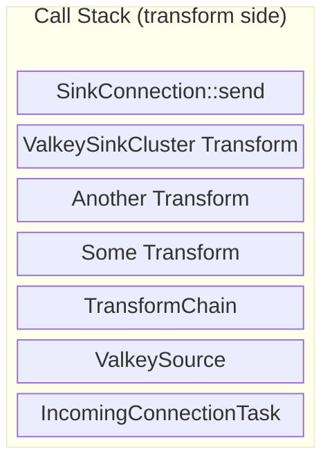

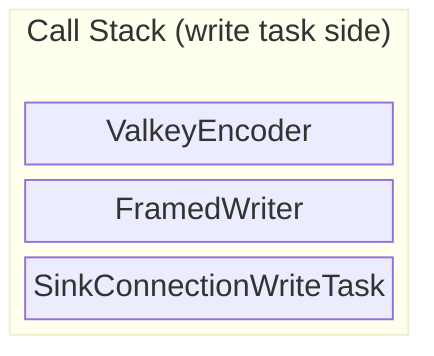

## Sink ValkeyEncoder

Earlier we talked about the `Encoder` and `Decoder` traits.
The [ValkeyEncoder](https://github.com/shotover/shotover-proxy/blob/33f49fc1976df84ed538c9f58dd51a160b642968/shotover/src/codec/valkey.rs#L67) is an example of an `Encoder` implementation.

The logic for [ValkeyEncoder::encode](https://github.com/shotover/shotover-proxy/blob/026327ff78046d29e9a7613baecca506c874d05b/shotover/src/codec/valkey.rs#L208) looks like:

1. The [into_encodable](https://github.com/shotover/shotover-proxy/blob/026327ff78046d29e9a7613baecca506c874d05b/shotover/src/message/mod.rs#L310) method is called on each request. This method returns the most efficient way to encode the request.
   * [Encodable::Frame](https://github.com/shotover/shotover-proxy/blob/026327ff78046d29e9a7613baecca506c874d05b/shotover/src/message/mod.rs#L619) - If the message is marked as modified by the transforms, the parsed valkey frame is returned, the encoder must reencode the bytes from the frame.
   * [Encodable::Bytes](https://github.com/shotover/shotover-proxy/blob/026327ff78046d29e9a7613baecca506c874d05b/shotover/src/message/mod.rs#L617) - If the message is not marked as modified, the raw bytes are returned and the encoder can simply write the raw bytes to the socket which is much faster.

In our example the request is unmodified so we take the fast path by directly writing the bytes.

You will recall that the original message was:

```text
*3
$3
SET
$3
foo
$3
bar
```

That message is what is written out over TCP.

Additionally the sink `ValkeyEncoder` sends some metadata to its sink `ValkeyDecoder` counterpart.
`Encoders` and `Decoders` are always [created in pairs](https://github.com/shotover/shotover-proxy/blob/026327ff78046d29e9a7613baecca506c874d05b/shotover/src/codec/valkey.rs#L33) allowing them to be assigned a [shared channel](https://github.com/shotover/shotover-proxy/blob/026327ff78046d29e9a7613baecca506c874d05b/shotover/src/codec/valkey.rs#L34-L40) at creation. This allows them to share state which is a requirement for working around stateful protocols.
The metadata sent to the `ValkeyEncoder` is a [RequestInfo](https://github.com/shotover/shotover-proxy/blob/33f49fc1976df84ed538c9f58dd51a160b642968/shotover/src/codec/valkey.rs#L52) which tells the decoder:

* The request ID of the next response it will receive.
  * In our case the ID was originally set to `0xd12ac2704d19e53ef3fea94b4885c950`
* The request type of the next response it will receive - Used to decide if `ValkeyDecoder` should enter pubsub mode.
  * In our case it is a simple `SET` request, so we are not entering pubsub mode.

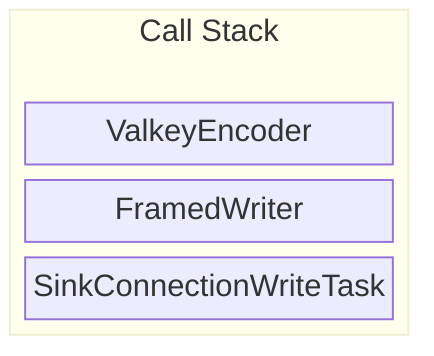

## Transform chain unwinds

Since the request has been sent on the TCP socket, the `ValkeySinkCluster` transform has no more work to do, so it returns.
In turn the other 2 transforms also return as they have completed.
Finally we get back to the `ValkeySource` which waits for either:

* A [new request](https://github.com/shotover/shotover-proxy/blob/de0d1a3fafb92cf1875dd9ca79b277faf3cb3e77/shotover/src/server.rs#L707) to come in from the client.
* A [new response](https://github.com/shotover/shotover-proxy/blob/de0d1a3fafb92cf1875dd9ca79b277faf3cb3e77/shotover/src/server.rs#L697) to come in from Valkey.

Asynchronously waiting for one of multiple events is achieved via a [tokio select macro](https://tokio.rs/tokio/tutorial/select).


## Valkey Instance

The request is received by Valkey.

Valkey modifies its internal value of `foo` to contain `bar` and then sends back a success response.
The success response is encoded in RESP as:

```text
+OK
```

## Sink ValkeyDecoder

Now the `ValkeyDecoder` is used again, but this time its for decoding a response instead of a request. Parsing a response has a few extra complexities that we don't have to deal with when parsing a request.

As with the source `ValkeyDecoder`, the sink `ValkeyDecoder` follows the same steps:

1. Receives the [raw bytes](https://github.com/shotover/shotover-proxy/blob/026327ff78046d29e9a7613baecca506c874d05b/shotover/src/codec/valkey.rs#L98) of the response `+OK`
2. [Parses](https://github.com/shotover/shotover-proxy/blob/026327ff78046d29e9a7613baecca506c874d05b/shotover/src/codec/valkey.rs#L100) this into the frame `ValkeyFrame::SimpleString("OK")`
3. Stores the raw bytes and frame of the response in a [Message](https://github.com/shotover/shotover-proxy/blob/026327ff78046d29e9a7613baecca506c874d05b/shotover/src/codec/valkey.rs#L109-L113).

Then things deviate a bit.

1. The `RequestInfo` from the sink `ValkeyEncoder` [is received](https://github.com/shotover/shotover-proxy/blob/026327ff78046d29e9a7613baecca506c874d05b/shotover/src/codec/valkey.rs#L160).
2. The request ID field of the response `Message` [is set to](https://github.com/shotover/shotover-proxy/blob/026327ff78046d29e9a7613baecca506c874d05b/shotover/src/codec/valkey.rs#L163) `0xd12ac2704d19e53ef3fea94b4885c950` the ID stored in the `RequestInfo`

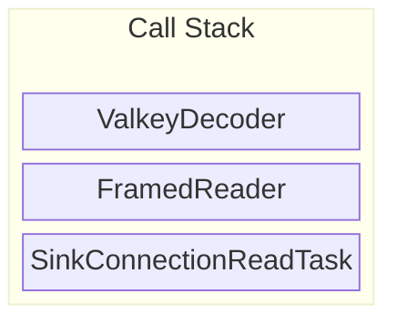

## SinkConnection receive

The ValkeyDecoder is driven by the `SinkConnection` read task.
The task waits for a response message to be successfully parsed from the TCP socket, once that occurs it will:

1. [Send the response](https://github.com/shotover/shotover-proxy/blob/9dd04c1f982a4fd1ffe7e565aea0514d295d9b6f/shotover/src/connection.rs#L352) to ValkeySinkCluster over the channel.
2. [Trigger](https://github.com/shotover/shotover-proxy/blob/9dd04c1f982a4fd1ffe7e565aea0514d295d9b6f/shotover/src/connection.rs#L357) the `force_run_chain` `Notify` to inform `ValkeySource` that it should run the transform chain as there is a pending response.
    * `Notify` is similar to a channel but carries no data, it is used only to await some kind of external event.
    * If we didn't notify the source about the pending response, the response would be stuck until the next request comes in, so `force_run_chain` allows us to trigger the transform chain early to prevent stuck responses.

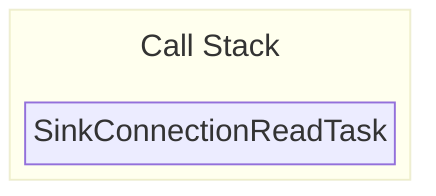

## Transform chain begins again

`ValkeySource` is [notified of force_run_chain](https://github.com/shotover/shotover-proxy/blob/de0d1a3fafb92cf1875dd9ca79b277faf3cb3e77/shotover/src/server.rs#L697).
It calls the transform chain which calls the first transform, which calls the second transform, which calls ValkeySinkCluster.
The transform chain was called with 0 requests, which is what happens when a `force_run_chain` occurs when there are no pending requests.
In this case the transforms just iterate over the 0 requests in `ChainState`, resulting in nothing occurring.
Then the transform calls the next transform in the chain.
Until finally ValkeySinkCluster transform is called.


## ValkeySinkCluster receives responses

`ChainState` contains no requests, so none are sent.
However `ValkeySinkCluster` does find that one of the outgoing `SinkConnection`s has a pending response.
So that connection is queried for responses and ValkeySinkCluster [includes the response in its return value](https://github.com/shotover/shotover-proxy/blob/de0d1a3fafb92cf1875dd9ca79b277faf3cb3e77/shotover/src/transforms/valkey/sink_cluster.rs#L1115).

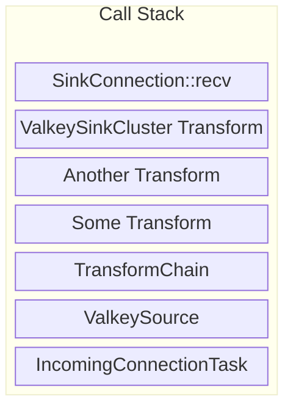

## The transform chain unwinds again

The transform chain unwinds again.
However this time there is a response Message being returned by the called transform.
Each transform now has an opportunity to inspect or rewrite the response.

Heres an example transform:

```rust
    async fn transform<'shorter, 'longer: 'shorter>(
        &mut self,
        chain_state: &'shorter mut ChainState<'longer>,
    ) -> Result<Messages> {
        for request in &mut chain_state.requests {
            // do something with the requests
        }

        let mut responses = chain_state.call_next_transform().await?;

        for response in responses.iter_mut() {
            if let Some(Frame::Valkey(frame)) = response.frame() {
                // Calling `frame` on the response returns the parsed frame of the message.
                // This assertion is silly, but would pass for the example response we are working through
                assert_eq!(
                    frame,
                    ValkeyFrame::SimpleString(Bytes::from_static("OK"))
                );

                // Calling `request_id` on the response returns the ID that was assigned to the request that this response is responding to.
                // Transforms can correlate requests to responses by calling `.id()` on requests and `.request_id()` on responses and comparing the results.
                //
                // This assertion is also silly, the id would be different every time.
                // But in this scenario that we are working through the request did in fact have this ID.
                assert_eq!(response.request_id(), Some(0xd12ac2704d19e53ef3fea94b4885c950));
            }
        }

        Ok(())
    }
```

Finally we get back to the `ValkeySource` which sends the response off to the source write task.


## Source ValkeyEncoder

Same as the sink write task, the source write task drives `FramedWrite` and `ValkeyEncoder`.
The source `ValkeyEncoder` is the [same implementation](https://github.com/shotover/shotover-proxy/blob/33f49fc1976df84ed538c9f58dd51a160b642968/shotover/src/codec/valkey.rs#L208) as the sink `ValkeyEncoder`:

* [into_encodable](https://github.com/shotover/shotover-proxy/blob/026327ff78046d29e9a7613baecca506c874d05b/shotover/src/message/mod.rs#L310) is called and then the returned value is encoded.
* However the source `ValkeyDecoder` does not need to worry about the request ID's or pubsub state, so there is no metadata sent to the source `ValkeyDecoder`.

Since the response is not modified at all, the raw bytes are written to the TCP socket:

```text
+OK
```

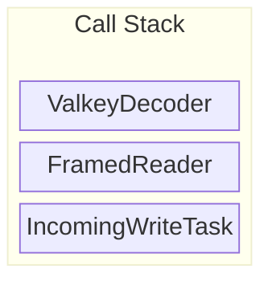

## The client receives response

The client receives the raw bytes `+OK` from the socket, parses it into `"OK"` and returns control back to the user since the request has succeeded.
